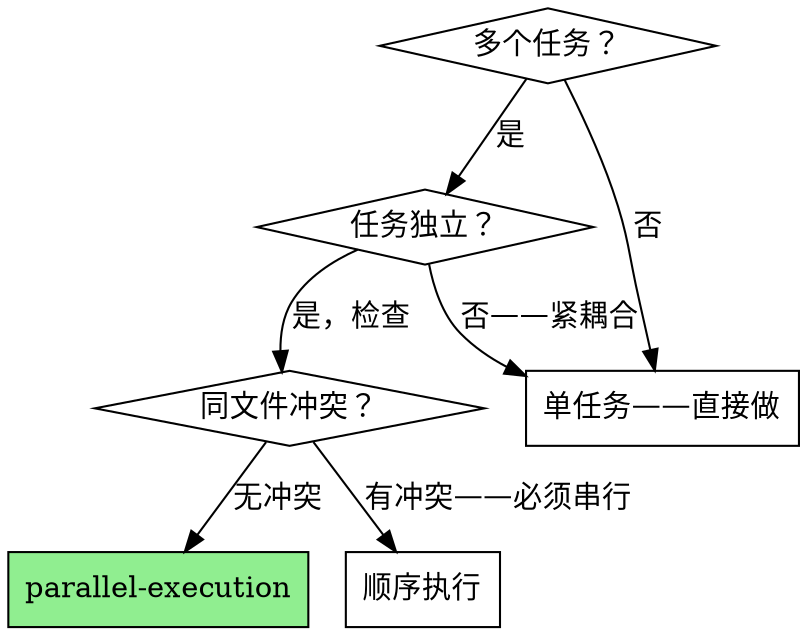

# 并行执行

通过为每个任务分配独立 agent 来执行多个独立任务。必须满足两个条件：(1) 任务独立（无文件冲突、无数据依赖），(2) 任务数量大于一个。

**为什么用 agent：** 每个任务获得隔离的上下文。任务之间无污染。你协调，它们执行。这保留了你的上下文用于综合。

**核心原则：** 先做依赖分析，再并行调度。永远不要假设任务有依赖——要验证。

**持续执行：** 任务之间不要暂停。调度所有独立任务，收集所有结果，然后汇报。唯一停止的理由：任务失败且你无法解决，或所有任务完成。

**开始时宣告：** "我正在使用 parallel-execution 调度 N 个任务。"

## 何时使用



## 硬门禁：依赖分析

```
在验证独立性之前，不得调度任务。

对每对任务 (A, B)：
- A 的输出是 B 的输入？→ B 依赖 A → 不独立
- A 和 B 修改同一文件？→ 冲突 → 不独立
- 都不是？→ 独立 → 可并行

如果跳过这一步凭猜测，你将：
- 把可以并行的任务串行化（浪费时间）
- 把有冲突的任务并行化（文件损坏）
```

## 执行流程

### 步骤 1：列出任务

从计划或用户请求中提取所有任务。每个任务需要：
- 输入：读取哪些文件/数据
- 输出：创建/修改哪些文件
- 完成标准：如何知道它已完成

### 步骤 2：依赖分析

应用硬门禁规则。产出以下之一：
- **全部独立** → 全部并行调度
- **DAG** → 按层调度（同层独立任务并行，层间串行）
- **全部依赖** → 串行（不强行并行）

### 步骤 3：调度

```
对每个独立任务：
  创建 agent 提示，包含：
    - 任务描述（做什么）
    - 输入文件（读什么）
    - 输出文件（创建/修改什么）
    - 完成标准（如何验证）
    - 约束（不要动范围外的文件）
    - 模型层级（可选）：从上游传入，ready=true 时用轻量模型设置，ready=false 时用默认

  调度方式：
    - Claude Code: Agent tool × N，全部 run_in_background；通过 model 参数指定模型层级
    - Agent Network: WorkUnit × N，agent 独立 Claim
```

### 步骤 4：收集结果

等待所有 agent 完成。对每个：
- 检查输出是否存在且满足完成标准
- 标记 PASS 或 FAIL
- 如果 FAIL：诊断、重试一次、或汇报

### 步骤 5：汇报

```
## 执行报告

| # | 任务 | 状态 | 输出 |
|---|------|------|------|
| 1 | 升级 skill-a | ✅ PASS | ~/.studio/skills/a/SKILL.md |
| 2 | 升级 skill-b | ✅ PASS | ~/.studio/skills/b/SKILL.md |
| 3 | 升级 skill-c | ❌ FAIL | error: ... |

总结：2/3 通过，1 失败（需重试）
```

## 反模式：常见借口

| # | 借口 | 反驳 |
|---|------|------|
| AP-1 | "这些任务看起来有依赖" | 先做步骤 2。90%"看起来有依赖"实际上是独立的。 |
| AP-2 | "并行太复杂，串行更安全" | 串行更慢。依赖分析 5 秒，串行执行 5 分钟。 |
| AP-3 | "让我先做一个看看效果" | 那是试点，不是并行化。如果任务同类，试点完成 → 全部调度。 |
| AP-4 | "Agent 开销太大" | 开销 ≈ 2 秒启动。收益 = N 倍速度。N>2 就值得。 |
| AP-5 | "我担心冲突" | 步骤 2 已验证无冲突。无冲突，并行无风险。 |
| AP-6 | "任务太小不值得并行" | 小任务 × N = 大总量。批量场景正是并行的优势所在。 |
| AP-7 | "我串行做更简单" | 对你简单，对等待的用户更慢。你的便利 ≠ 用户的优先级。 |

## 自检

执行后：

- [ ] 是否做了依赖分析（不只是猜"它们有依赖"）？
- [ ] 是否真正并行调度了（不是串行然后说"可以并行"）？
- [ ] 是否收集了所有结果（没有遗漏 agent）？
- [ ] 是否处理了失败（重试或汇报，不是忽略）？

## 终端状态

```
所有任务 PASS → 向用户汇报结果。
如果这是更大链路的一部分 → 调用下一个 skill（如实现任务的 code-review）。
任何任务 FAIL → 汇报失败，询问用户如何处理。
```

## 示例

### 独立任务

```
用户："升级这 7 个 Skill 的质量机制"

依赖分析：7 个 Skill，各自在独立目录，无文件重叠。
→ 调度：7 个 agent，每个升级一个 Skill
→ 收集：7 个结果
→ 汇报：汇总表
```

### DAG（有依赖的层）

```
用户："升级 Skills，然后 eval，然后 commit"

依赖分析：
- 升级 × 7：独立 → 并行（层 1）
- Eval × 7：依赖升级 → 层 1 之后，并行（层 2）
- Commit：依赖 eval → 层 2 之后（层 3）

→ 3 层：[升级×7] → [eval×7] → [commit]
```
