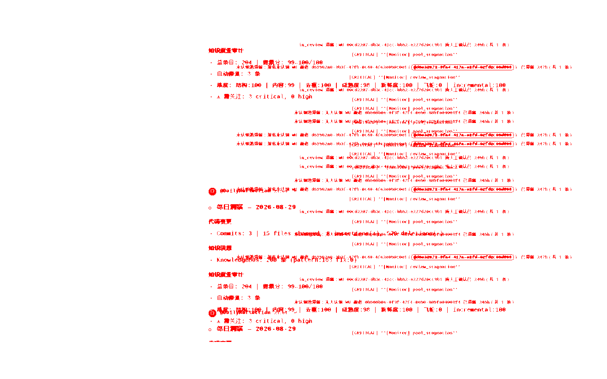
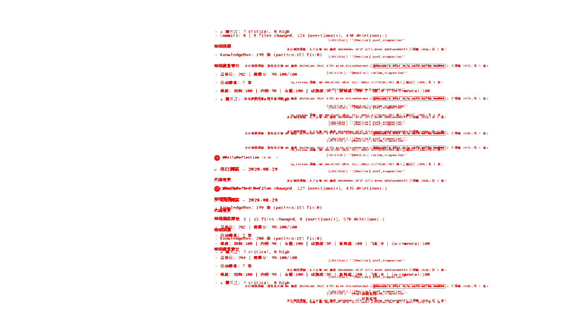
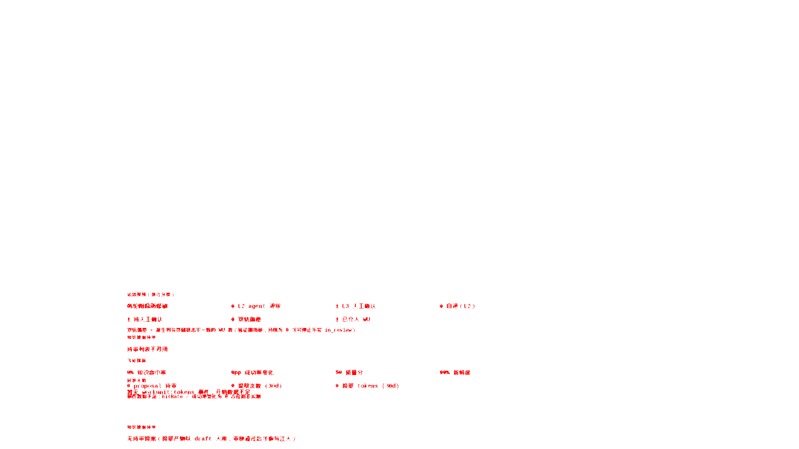

# 截图 diff 报告

- 比对：`baseline-pre-redesign` vs `stability-check`
- 生成时间：2026-08-29T15:29:04.176Z
- 总计：36 张 —— clean 31 / minor 3 / major 2 / missing 0

| 页面 | 宽度 | 差异率 | 像素数 | 状态 |
|------|------|--------|--------|------|
| agent-detail | 1280 | 0.00% | 0 | clean |
| agent-detail | 1440 | 0.00% | 0 | clean |
| agent-detail | 1920 | 0.00% | 0 | clean |
| agents | 1280 | 0.00% | 0 | clean |
| agents | 1440 | 0.00% | 0 | clean |
| agents | 1920 | 0.00% | 0 | clean |
| channel-detail | 1280 | 0.00% | 0 | clean |
| channel-detail | 1440 | 3.79% | 49183 | major |
| channel-detail | 1920 | 2.95% | 61263 | major |
| channels | 1280 | 0.00% | 0 | clean |
| channels | 1440 | 0.00% | 0 | clean |
| channels | 1920 | 0.00% | 0 | clean |
| knowledge | 1280 | 0.00% | 0 | clean |
| knowledge | 1440 | 0.00% | 0 | clean |
| knowledge | 1920 | 0.00% | 0 | clean |
| library | 1280 | 0.00% | 0 | clean |
| library | 1440 | 0.00% | 0 | clean |
| library | 1920 | 0.00% | 0 | clean |
| monitoring | 1280 | 0.00% | 0 | clean |
| monitoring | 1440 | 0.00% | 0 | clean |
| monitoring | 1920 | 0.59% | 12295 | minor |
| pmo | 1280 | 0.01% | 93 | minor |
| pmo | 1440 | 0.00% | 0 | clean |
| pmo | 1920 | 0.00% | 93 | minor |
| pmo-project | 1280 | 0.00% | 0 | clean |
| pmo-project | 1440 | 0.00% | 0 | clean |
| pmo-project | 1920 | 0.00% | 0 | clean |
| settings | 1280 | 0.00% | 0 | clean |
| settings | 1440 | 0.00% | 0 | clean |
| settings | 1920 | 0.00% | 0 | clean |
| workunit-detail | 1280 | 0.00% | 0 | clean |
| workunit-detail | 1440 | 0.00% | 0 | clean |
| workunit-detail | 1920 | 0.00% | 0 | clean |
| workunits | 1280 | 0.00% | 0 | clean |
| workunits | 1440 | 0.00% | 0 | clean |
| workunits | 1920 | 0.00% | 0 | clean |

## 差异页对比图

### channel-detail-1440.png（3.79%）

### channel-detail-1920.png（2.95%）

### monitoring-1920.png（0.59%）

### pmo-1280.png（0.01%）

### pmo-1920.png（0.00%）

## 归因（人工补注，#390 口径：不追零 diff，追可归因）

- **channel-detail 1440/1920（major）**：两轮之间 #系统 频道有 SSE 新消息插入（Monitor 告警洪水 + DailyReflection 打卡），消息流滚动窗口随新消息移动。数据面动态，非布局问题。
- **monitoring 1920（minor 0.59%）**：页面下部飞轮指标/知识健康区计数两轮间变动（数据面）。
- **pmo 1280/1920（minor 93px）**：项目行「WU 1/1」进度文本像素级变化（数据面/抗锯齿级）。
- 其余 31 张零 diff：稳定化（禁动画 + 假时钟 + data-visual-ignore + 等加载态消失）生效。
