# 截图 diff 报告

- 比对：`i437-before` vs `i437-after`
- 生成时间：2026-09-02T10:37:01.710Z
- 总计：87 张 —— clean 71 / minor 13 / major 3 / missing 0

| 页面 | 宽度 | 差异率 | 像素数 | 状态 |
|------|------|--------|--------|------|
| agent-detail | 1280 | 0.00% | 0 | clean |
| agent-detail | 1440 | 0.00% | 0 | clean |
| agent-detail | 1920 | 0.00% | 0 | clean |
| agents | 1280 | 0.00% | 0 | clean |
| agents | 1440 | 0.00% | 0 | clean |
| agents | 1920 | 0.00% | 0 | clean |
| audit-logs | 1280 | 0.12% | 1226 | minor |
| audit-logs | 1440 | 0.14% | 1854 | minor |
| audit-logs | 1920 | 0.11% | 2268 | minor |
| audit-logs-empty | 1280 | 0.03% | 345 | minor |
| audit-logs-empty | 1440 | 0.00% | 0 | clean |
| audit-logs-empty | 1920 | 0.02% | 472 | minor |
| audit-logs-modal-log-detail | 1280 | 0.04% | 361 | minor |
| audit-logs-modal-log-detail | 1440 | 0.03% | 340 | minor |
| audit-logs-modal-log-detail | 1920 | 0.02% | 349 | minor |
| audit-logs-select-open | 1280 | 0.12% | 1226 | minor |
| audit-logs-select-open | 1440 | 0.14% | 1854 | minor |
| audit-logs-select-open | 1920 | 0.11% | 2268 | minor |
| channel-detail | 1280 | 2.30% | 23562 | major |
| channel-detail | 1440 | 3.29% | 42620 | major |
| channel-detail | 1920 | 3.39% | 70339 | major |
| channels | 1280 | 0.00% | 0 | clean |
| channels | 1440 | 0.00% | 0 | clean |
| channels | 1920 | 0.00% | 0 | clean |
| knowledge | 1280 | 0.00% | 0 | clean |
| knowledge | 1440 | 0.00% | 0 | clean |
| knowledge | 1920 | 0.00% | 0 | clean |
| library | 1280 | 0.00% | 0 | clean |
| library | 1440 | 0.00% | 0 | clean |
| library | 1920 | 0.00% | 0 | clean |
| library-doc | 1280 | 0.00% | 0 | clean |
| library-doc | 1440 | 0.00% | 0 | clean |
| library-doc | 1920 | 0.00% | 0 | clean |
| monitoring | 1280 | 0.00% | 0 | clean |
| monitoring | 1440 | 0.00% | 0 | clean |
| monitoring | 1920 | 0.00% | 0 | clean |
| notfound | 1280 | 0.00% | 0 | clean |
| notfound | 1440 | 0.00% | 0 | clean |
| notfound | 1920 | 0.00% | 0 | clean |
| pmo | 1280 | 0.00% | 0 | clean |
| pmo | 1440 | 0.00% | 0 | clean |
| pmo | 1920 | 0.00% | 0 | clean |
| pmo-project | 1280 | 0.00% | 0 | clean |
| pmo-project | 1440 | 0.00% | 0 | clean |
| pmo-project | 1920 | 0.00% | 0 | clean |
| settings | 1280 | 0.00% | 0 | clean |
| settings | 1440 | 0.00% | 0 | clean |
| settings | 1920 | 0.00% | 0 | clean |
| settings-bell-open | 1280 | 0.00% | 0 | clean |
| settings-bell-open | 1440 | 0.00% | 0 | clean |
| settings-bell-open | 1920 | 0.00% | 0 | clean |
| settings-modal-studio-role-setup | 1280 | 0.22% | 2259 | minor |
| settings-modal-studio-role-setup | 1440 | 0.19% | 2492 | minor |
| settings-modal-studio-role-setup | 1920 | 0.00% | 0 | clean |
| settings-more-open | 1280 | 0.00% | 0 | clean |
| settings-more-open | 1440 | 0.00% | 0 | clean |
| settings-more-open | 1920 | 0.00% | 0 | clean |
| settings-toast | 1280 | 0.00% | 0 | clean |
| settings-toast | 1440 | 0.00% | 0 | clean |
| settings-toast | 1920 | 0.00% | 0 | clean |
| setup-roles | 1280 | 0.00% | 0 | clean |
| setup-roles | 1440 | 0.00% | 0 | clean |
| setup-roles | 1920 | 0.00% | 0 | clean |
| workspace | 1280 | 0.00% | 0 | clean |
| workspace | 1440 | 0.00% | 0 | clean |
| workspace | 1920 | 0.00% | 0 | clean |
| workspace-modal-create-role | 1280 | 0.00% | 0 | clean |
| workspace-modal-create-role | 1440 | 0.00% | 0 | clean |
| workspace-modal-create-role | 1920 | 0.00% | 0 | clean |
| workunit-detail | 1280 | 0.00% | 0 | clean |
| workunit-detail | 1440 | 0.00% | 0 | clean |
| workunit-detail | 1920 | 0.00% | 0 | clean |
| workunit-detail-modal-reject | 1280 | 0.00% | 0 | clean |
| workunit-detail-modal-reject | 1440 | 0.00% | 0 | clean |
| workunit-detail-modal-reject | 1920 | 0.00% | 0 | clean |
| workunits | 1280 | 0.00% | 0 | clean |
| workunits | 1440 | 0.00% | 0 | clean |
| workunits | 1920 | 0.00% | 0 | clean |
| workunits-long-scope | 1280 | 0.00% | 0 | clean |
| workunits-long-scope | 1440 | 0.00% | 0 | clean |
| workunits-long-scope | 1920 | 0.00% | 0 | clean |
| workunits-modal-approve | 1280 | 0.00% | 0 | clean |
| workunits-modal-approve | 1440 | 0.00% | 0 | clean |
| workunits-modal-approve | 1920 | 0.00% | 0 | clean |
| workunits-modal-reject | 1280 | 0.00% | 0 | clean |
| workunits-modal-reject | 1440 | 0.00% | 0 | clean |
| workunits-modal-reject | 1920 | 0.00% | 0 | clean |

## 差异页对比图

### audit-logs-1280.png（0.12%）

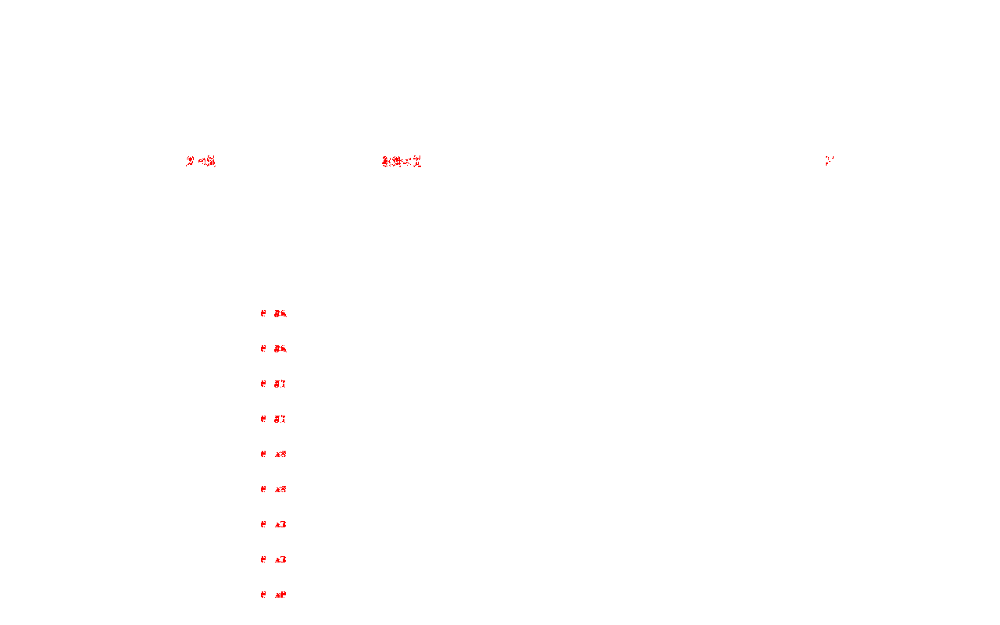

### audit-logs-1440.png（0.14%）

### audit-logs-1920.png（0.11%）

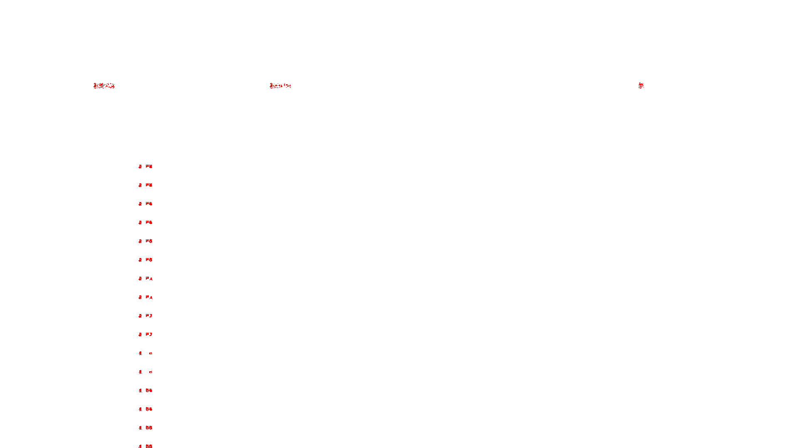

### audit-logs-empty-1280.png（0.03%）

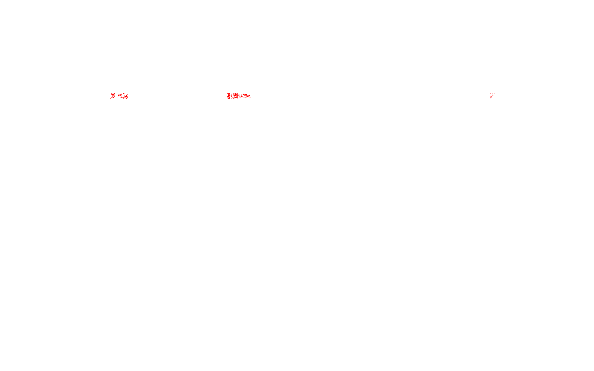

### audit-logs-empty-1920.png（0.02%）

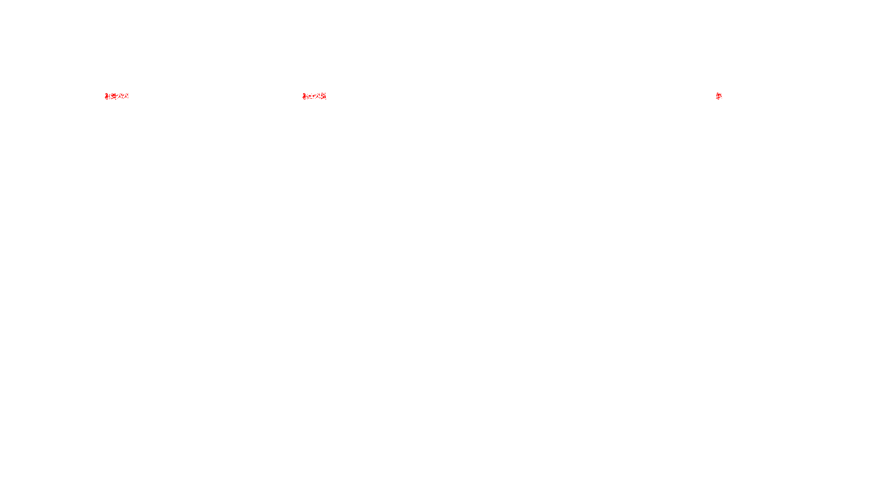

### audit-logs-modal-log-detail-1280.png（0.04%）

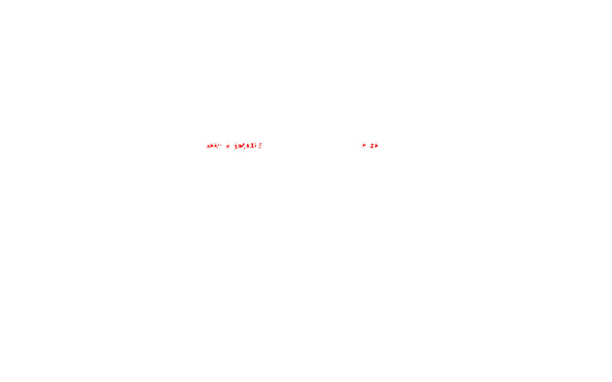

### audit-logs-modal-log-detail-1440.png（0.03%）

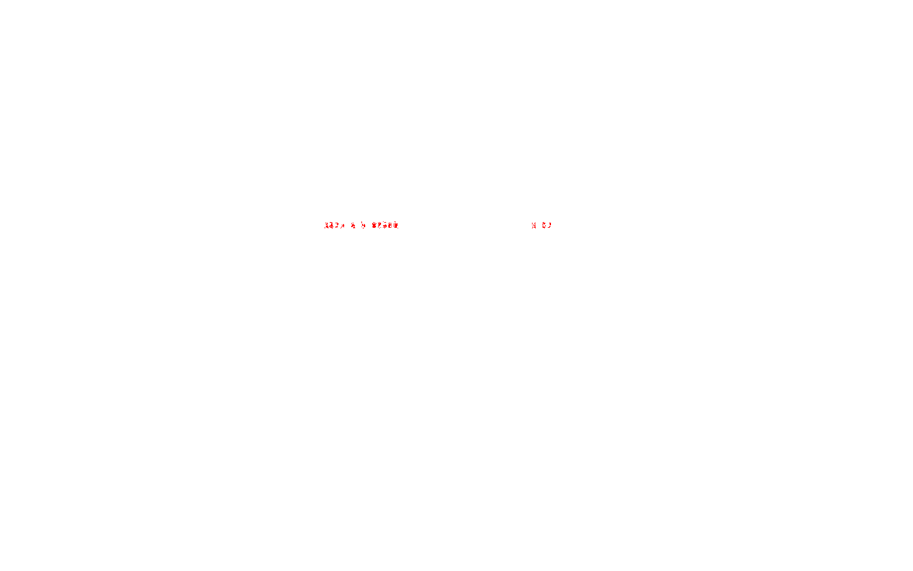

### audit-logs-modal-log-detail-1920.png（0.02%）

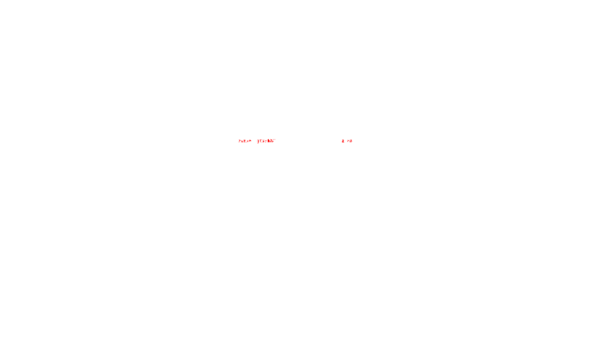

### audit-logs-select-open-1280.png（0.12%）

### audit-logs-select-open-1440.png（0.14%）

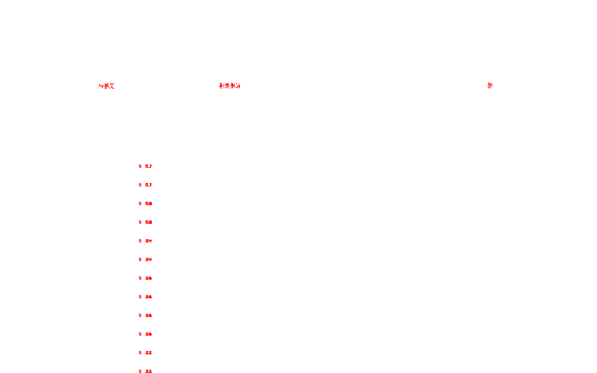

### audit-logs-select-open-1920.png（0.11%）

### channel-detail-1280.png（2.30%）

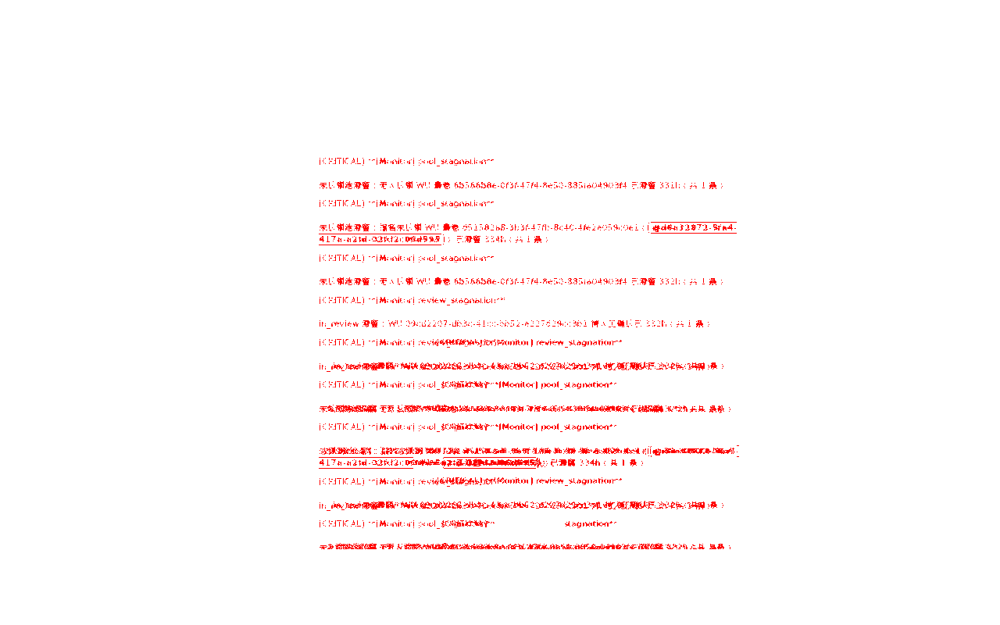

### channel-detail-1440.png（3.29%）

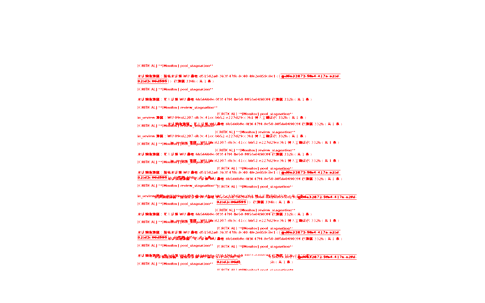

### channel-detail-1920.png（3.39%）

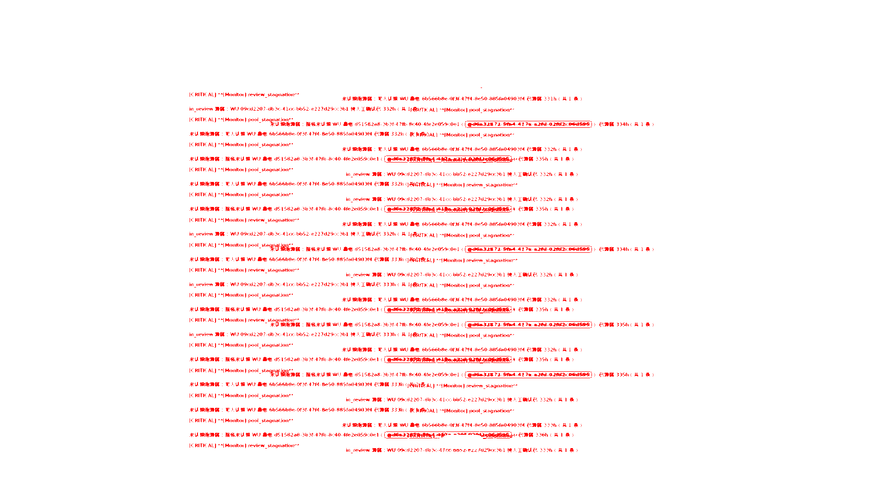

### settings-modal-studio-role-setup-1280.png（0.22%）

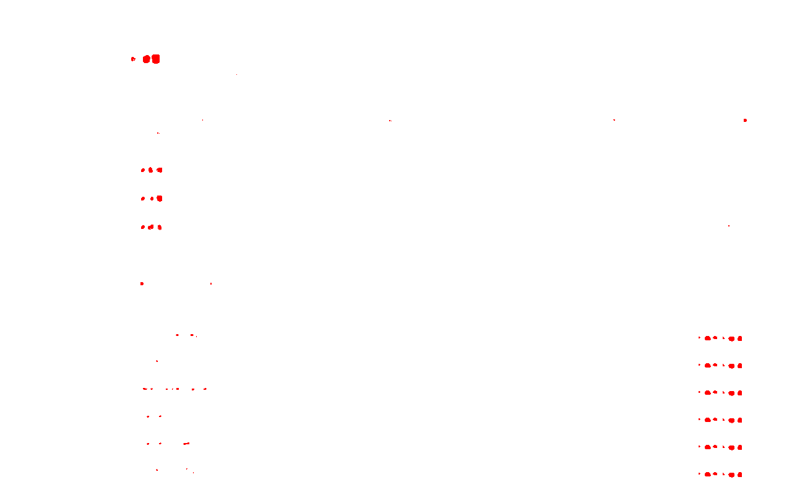

### settings-modal-studio-role-setup-1440.png（0.19%）

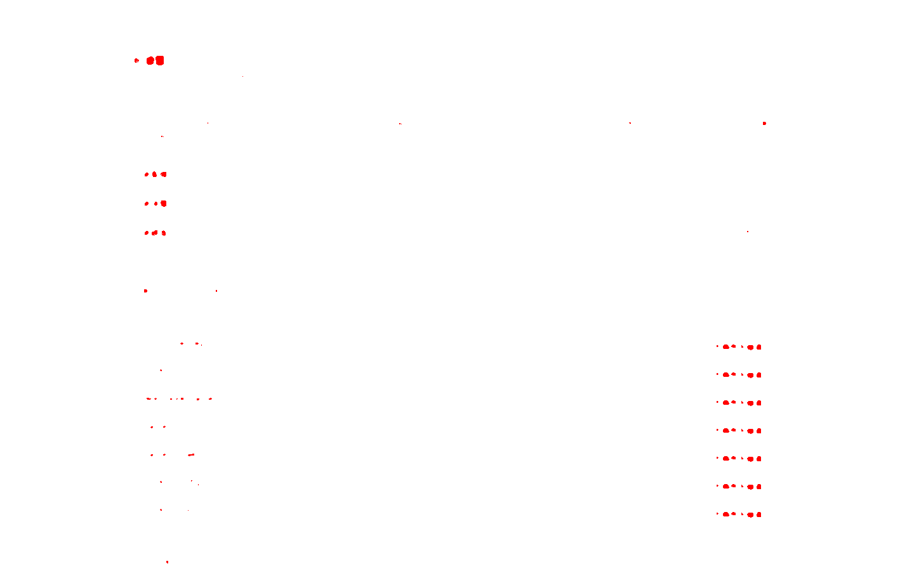

## 归因

本报告为 #437（频道系统播报左对齐）前后对照：before = 修复前 CSS（系统播报居中），after = 修复后（左对齐随文档流）。

- **channel-detail ×3（major，2.30%/3.29%/3.39%）**：预期差异。diff 掩码呈「旧居中位置 + 新左对齐位置」双影，即系统播报从栏中移到左缘；叠加 README 已登记的不可消除噪声——#系统 频道 Monitor 告警洪水导致两轮间 SSE 新消息插入、滞留时长计数（332h→336h）变化。逐张过目确认无对齐以外的样式破坏。
- **audit-logs 族（minor，≤0.14%）**：两轮之间新增审计日志行导致表格行位移 + 时间戳文本变化，与本改动无关（该页无 `mc-msg-system` 消费点）。
- **settings-modal-studio-role-setup 1280/1440（minor，≤0.22%）**：交互态 prepare 翻牌 studio 角色 provider 再还原，两轮间 provider 列表/状态文本微差；1920 档 clean 佐证非样式回归。与本改动无关。
